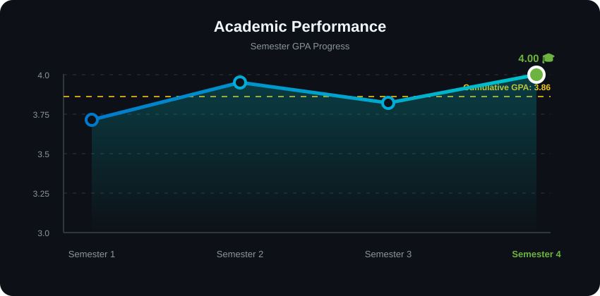

  <h1>Hi, I'm Ryan Muhamad Saputra 👋</h1>
  <h3>Aspiring AI Engineer | Informatics Student</h3>
  
  

    
    
    
  

---

### 👨‍💻 About Me

I am a dedicated **Informatics Engineering student** at **Telkom University Purwokerto**, driven by a passion for solving complex problems through technology. My primary focus is on **Artificial Intelligence**, **Machine Learning**, and **Software Engineering**.

Currently, I am expanding my expertise in system-level programming and application development, ensuring that I can build software that is not only smart but also efficient and robust.

* 🎓 Pursuing a Bachelor's Degree in **Informatics**.
* 💻 Experienced in building **Applications** and **Backend Systems** using **C++, C, Python, and Go**.
* 🤖 Specialized in **AI & Machine Learning** (Algorithms, MLOps, Data Processing).
* 🌱 Constantly exploring advanced software architecture and efficient coding practices.
* 🤝 Open to collaboration on AI research or challenging software development projects.

---

### 🚀 Technical Skills

#### 💻 Programming Languages

    
    
    
    
    
    
    
    
    

#### ☕ Java & Backend Frameworks

    
    
    

#### 🌐 Networking & Systems

    
    
    
    
    

#### 🧠 AI & Machine Learning Frameworks

    
    
    
    
    

#### 📊 Data Analysis & Visualization

    
    
    
    
    
    

#### 🛠️ Dev Tools & Environment

    
    
    
    
    
    
    

#### 🎨 Design & Creative Tools

    
    
    
    
    

---

### 📈 Academic Performance

  

  
  

